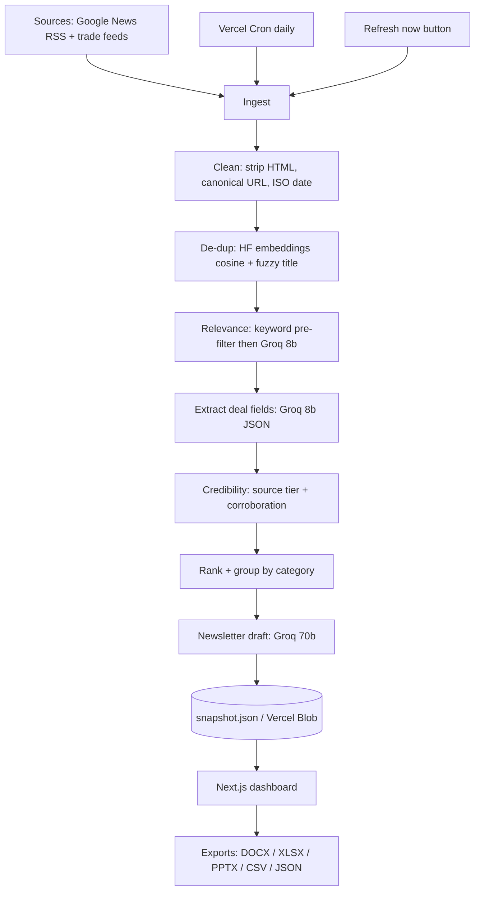
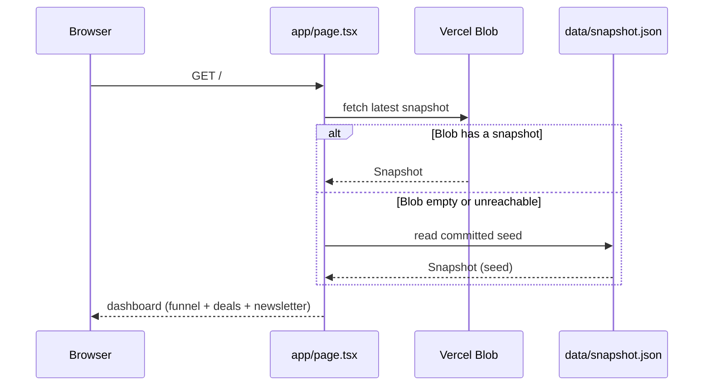
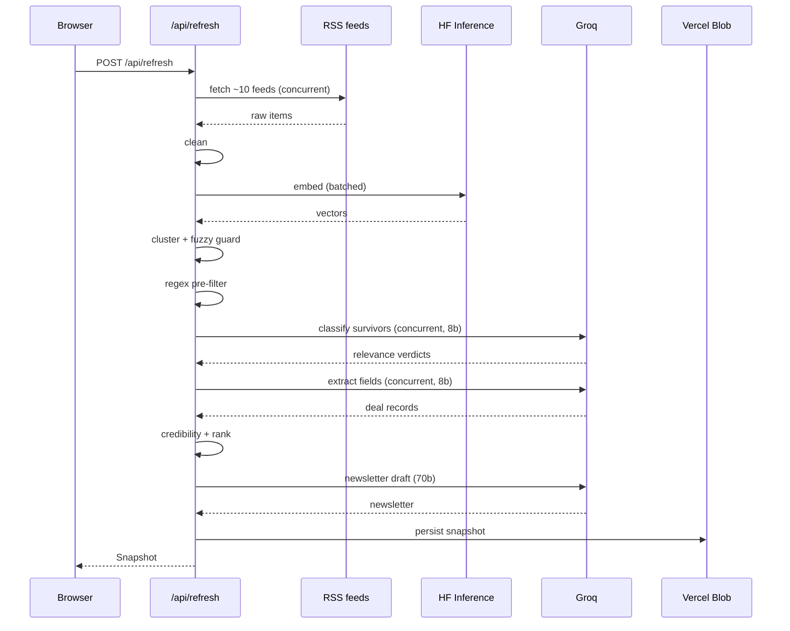

# Architecture

## System overview

## The central idea: snapshot as the only contract

Everything upstream of `snapshot.json` is a batch pipeline. Everything downstream is a pure
function of it. The UI never calls Groq, never fetches RSS, and never knows a pipeline
exists — it reads one JSON object and renders it.

This buys three things that matter for a 4-day build:

1. **The demo is never empty.** A seed snapshot is committed to the repo, so a fresh clone
   or a cold Vercel deploy renders real content with zero API keys configured.
2. **Exports are trivial.** DOCX, XLSX, PPTX, CSV, and JSON are five renderers over one
   in-memory object. No export path can disagree with the dashboard, because there is only
   one source of truth.
3. **The pipeline is independently runnable.** `scripts/run-pipeline.ts` produces the same
   artifact as `/api/refresh`. Local iteration doesn't require a deployed environment.

The cost is that the data is only as fresh as the last run. That is an accepted trade-off —
see [assumptions.md](./assumptions.md) on what "real-time" means here.

## Layers

| Layer | Location | Responsibility |
|---|---|---|
| Sources | `lib/sources.ts` | Feed registry, source→tier mapping, query construction |
| Pipeline | `lib/pipeline/*.ts` | Eight pure-ish stages, each independently testable |
| Providers | `lib/groq.ts`, `lib/hf.ts` | Thin clients — retry, JSON coercion, batching |
| Persistence | Vercel Blob + `data/snapshot.json` | Snapshot write (live) / seed (committed) |
| Presentation | `app/page.tsx`, `components/` | Dashboard, funnel panel, deals table, newsletter |
| Export | `lib/export/*.ts`, `app/api/export/[format]` | Five renderers over one snapshot |

Each pipeline stage takes data and returns data. No stage reaches for the network except
`ingest` (RSS), `dedup` (HF embeddings), and `relevance`/`extract`/`newsletter` (Groq). That
keeps the pure transformation logic — cleaning, ranking, credibility — trivially unit-testable
without mocks.

## Request flows

### Cold read (the common case)

The fallback to the committed seed is what guarantees the demo always has content. A missing
`BLOB_READ_WRITE_TOKEN`, a cold deploy, or a failed cron all degrade to "shows the seed"
rather than "shows an error".

### Live refresh

## Runtime and timeout strategy

Vercel's Hobby tier caps a function at 60s. The pipeline makes a lot of network calls, so
this is the real engineering constraint of the project.

Mitigations, in order of importance:

- **`export const maxDuration = 60`** on `/api/refresh` — take the full budget.
- **Bound the fan-in.** ~10 feeds, not 40. Cap items per feed.
- **Filter before paying.** The regex pre-filter runs before any LLM call, so only plausible
  deal articles reach Groq. This is the single biggest lever on both latency and cost.
- **Concurrency everywhere.** Feeds fetch concurrently; classify and extract run concurrently
  per item. Groq is fast enough that the wall-clock is dominated by fan-out width, not
  per-call latency.
- **One 70b call, not N.** Only the final newsletter draft uses the large model, once, over
  the already-ranked top ~10–12.

**Fallback if a live run still risks the limit:** split into a staged
`/api/pipeline?stage=` endpoint driven by a client-side progress bar, so each stage gets its
own 60s budget. Sequenced but never truncated. This is the escape hatch, not the default.

### The real constraint is the provider, not Vercel

Measured, and it reframes the whole timeout question: **the binding limit is free-tier LLM
rate limiting, not the 60s function ceiling.**

Groq's free tier is **6,000 tokens/minute**, and that number governs everything. The same
relevance stage ran in **1.7s on a fresh quota and 67s once exhausted** — a 40x swing from
throttling alone.

Two measured lessons:

- **Concurrency actively hurts.** At 8 concurrent calls one request blocked for 25s while
  sequential calls returned in 0.3s, and 10 of 24 failed outright. The limiter is the
  bottleneck, so parallelism buys nothing and costs reliability. `relevance.ts` caps
  concurrency at 2.
- **Tokens are the currency, not calls.** Sending the full ~700-token classification prompt
  per batch cost ~26,000 tokens for one 90-day run — over four minutes of budget. Rewriting
  the first pass to screen titles only, with a ~120-token prompt and `{"n":1,"d":1}` output,
  cut a batch of 25 articles to **~737 tokens**. All ~128 candidates now screen for ~4,400
  tokens, inside a single TPM window.

Scale at a 90-day window: ~385 raw articles → ~128 pre-filter survivors → ~6 screen calls,
~3 confirm calls, plus extraction. Tight enough to run, but still not a 60s budget once
extraction and drafting are added — which is why the seed is generated offline.

**The snapshot architecture already answers this**, which is the useful part:

| Path | Time budget | Window |
|---|---|---|
| `npm run pipeline` → committed seed | none (runs locally, minutes are fine) | full 90 days |
| `/api/refresh` → live snapshot | 60s hard | narrower — fewer queries, tighter window |

The seed is generated offline precisely so the demo doesn't depend on the pipeline being
fast. The Refresh button proves the pipeline is real; it doesn't have to reproduce the whole
90-day corpus in one request. Separating those two budgets is what makes both honest.

## Persistence model

There are two snapshot locations and they serve different purposes:

- `data/snapshot.json` — **committed seed.** Regenerated locally via `scripts/run-pipeline.ts`
  and checked in. Read-only at runtime. Guarantees a non-empty demo.
- Vercel Blob — **live snapshot.** Written by `/api/refresh` and the daily cron. Read
  preferentially; falls back to the seed.

No database. The dataset is ~10–12 deals over a 90-day window — a single JSON object is the
right size, and adding Postgres would be strictly more moving parts for zero benefit.

## Deployment

| Concern | Choice |
|---|---|
| Host | Vercel (single Next.js App Router project) |
| Cron | Vercel Cron, daily → `/api/refresh`, guarded by `CRON_SECRET` |
| Blob | Vercel Blob (`BLOB_READ_WRITE_TOKEN`) |
| Inference | Groq API (`GROQ_API_KEY`) |
| Embeddings | HuggingFace Inference API (`HF_API_TOKEN`) |

All four env vars are optional for a read-only demo — the app falls back to the committed
seed when they're absent. They're required for live refresh.

## Why not the obvious alternatives

**Why no database?** The working set is a dozen deals. A JSON blob is the correctly-sized
tool; Postgres would add a migration story, a connection-pooling story, and a cold-start
story for no gain.

**Why not stream / always-on ingestion?** The assignment values a demonstrable pipeline over
infrastructure. Daily cron + on-demand refresh covers the same ground at a fraction of the
complexity. Stated plainly in [assumptions.md](./assumptions.md) rather than papered over.

**Why Groq over a frontier model?** Latency. The 60s budget makes throughput the binding
constraint, and `8b-instant` at Groq speeds means the fan-out over ~50 candidate articles
fits comfortably. Quality where it matters — the newsletter prose — gets the 70b model.

**Why HF embeddings rather than an LLM for dedup?** Dedup is a similarity problem, not a
reasoning problem. `all-MiniLM-L6-v2` is a few milliseconds and effectively free; asking an
LLM "are these the same story?" pairwise is O(n²) LLM calls for a worse answer.
